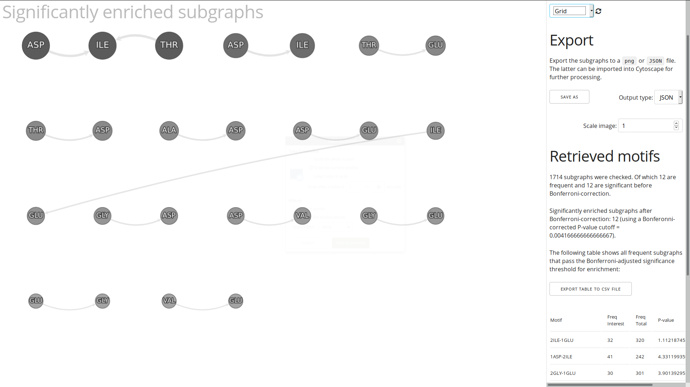
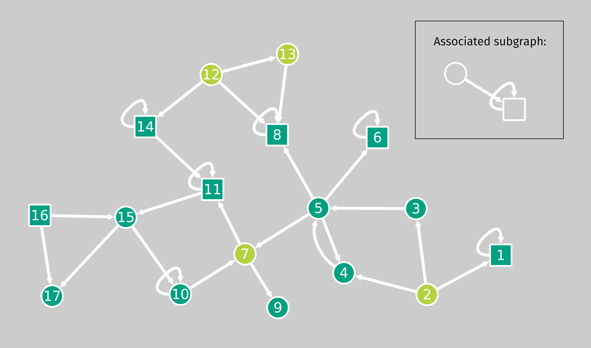

# MILES - MIning Labeled Enriched Subgraphs

<!-- @import "[TOC]" {cmd="toc" depthFrom=1 depthTo=6 orderedList=false} -->

<!-- code_chunk_output -->

- [MILES - MIning Labeled Enriched Subgraphs](#miles-mining-labeled-enriched-subgraphs)
  - [Purpose of the tool](#purpose-of-the-tool)
  - [Installation](#installation)
    - [Prerequisites](#prerequisites)
    - [Local executable](#local-executable)
    - [Compiling from source](#compiling-from-source)
    - [Docker](#docker)
  - [How to use MILES](#how-to-use-miles)
    - [Quick start](#quick-start)
    - [Input files](#input-files)
    - [Options](#options)
    - [Command line options](#command-line-options)
    - [Output](#output)
    - [MILES as a GO/pathway enrichment tool](#miles-as-a-gopathway-enrichment-tool)
      - [Generating genes of interest file from a DESeq2 analysis](#generating-genes-of-interest-file-from-a-deseq2-analysis)
  - [Example datasets](#example-datasets)
    - [Toy dataset](#toy-dataset)
    - [Gene ontology protein-protein interaction modules enriched in differentially expressed genes after Hepatitis B vaccination](#gene-ontology-protein-protein-interaction-modules-enriched-in-differentially-expressed-genes-after-hepatitis-b-vaccination)
    - [Manganese binding motifs in peptidase protein structures](#manganese-binding-motifs-in-peptidase-protein-structures)
    - [Duplicated genes in the yeast transcription regulatory network](#duplicated-genes-in-the-yeast-transcription-regulatory-network)
    - [Orthologous genes in prokaryotic transcription regulation networks](#orthologous-genes-in-prokaryotic-transcription-regulation-networks)
  - [Implementation of the subgraph discovery algorithm](#implementation-of-the-subgraph-discovery-algorithm)
  - [What is an associated subgraph and what are the statistics behind it?](#what-is-an-associated-subgraph-and-what-are-the-statistics-behind-it)
    - [Interestingness measure](#interestingness-measure)
    - [Hypergeometric distribution](#hypergeometric-distribution)
    - [Hypergeometric test](#hypergeometric-test)
    - [Equivalence to Fisher's exact test](#equivalence-to-fishers-exact-test)
      - [Multiple testing correction](#multiple-testing-correction)
  - [History of the algorithm](#history-of-the-algorithm)
    - [Citation](#citation)
  - [Authors](#authors)

<!-- /code_chunk_output -->

<a name="visualisation"></a> 

## Purpose of the tool

MILES is a Java tool to discover **subgraphs** (or network motifs) in a graph (or network) that are **significantly associated** with a given **set of vertices** (or nodes) of interest. In other words, the goal is to search for subgraphs that are enriched in a selected subset of vertices compared to the graph as a whole. For more information on enriched subgraphs and how they are measured, please refer to the [statistics section](#what-is-an-enriched-subgraph-and-what-are-the-statistics-behind-it).

MILES should work on most regular-sized biological networks with any number of selected vertices. Nodes can be unlabelled or (multi)-labelled. It can deal with a large variety of data types, ranging from regulatory gene networks to protein-protein interaction networks and many other situation where graph data arises, since it does not rely on any specific type of input data beyond edge and label mappings in a simple flat text format.

The networks compatible with MILES can consist of various types of biological entities, such as proteins, genes, metabolites or amino acid residues, whose relation can be described through edges. The nodes of interest can originate from experimental results (e.g. a list of differentially expressed genes in an expression assay) or essentially any other method of delineating a subset within the network based on certain properties (e.g. the target proteins of a small molecule that is being studied). Given such a network and list of interesting nodes, MILES finds motifs that are significantly associated with, or enriched in, the nodes of interest. The retrieved subgraphs can either consist of only a topological structure (e.g. a feed-forward/back loop in a regulatory network) or they can include relevant biological labels (e.g. a self-regulating transcription factor).

Because this enriched subgraph mining approach is not tailored to a specific type of biological network, it can accommodate a broad range of hypotheses by placing the entities under study in a network context and analysing their role within it. In this manner, additional information, in the form of both network structure and labels derived from various annotation sources, becomes available for inference. It can be seen as an extension of more standard enrichment analysis methodologies that integrates network information in order to discover novel and biologically relevant patterns among a subset of the biological entities under study.

Note that MILES can also be used to perform regular frequent subgraph mining instead of searching for enrichment in a specific subset.

This implementation is provided for free and is intended for research purposes. Some bugs may be present within the software and no guarantees are given! The included [example datasets](#examples) are for illustrative and testing purposes. We would appreciate any comments, bug descriptions, suggestions or success stories regarding the tool.

## Installation

### Prerequisites

The standard JAR version of MILES requires Java version 8 or higher. Installation instructions for various operating systems can be found on the [Java website](https://www.java.com/en/download/help/download_options.xml).

### Local executable

The latest version of the runnable JAR file is available from our [releases page](https://github.com/pmoris/subgraph-miner/releases).

MILES requires no true installation. The JAR file can simply be invoked from the [command line](#command-line-options) (recommended). Alternatively, the file can be launched directly to open the GUI version of the tool. The required input files and analysis options are described [below](#how-to-use-miles).

### Compiling from source

These instructions will give you a copy of the project on your local machine for development and testing purposes.

- Clone the repository from GitHub or download the source archive from the [release page]().
- Compile the source code via:
  - [Apache Ant](http://ant.apache.org/): `ant all`.
  - Or an IDE such as Eclipse (don't forget to add the external jar libraries in the `lib` directory and JUnit 5 to the classpath).

### Docker

A Dockerized version of MILES is also available.

To build the image:

```
# Download or clone the repository
git clone https://github.com/pmoris/miles-subgraph-miner.git && cd miles-subgraph-miner
# build the image locally (default user)
docker build -f docker/Dockerfile -t miles .
```

To run an analysis, simply append the desired command line arguments to the `docker run` command:

```
docker run --rm miles \
-graph datasets/example/example_graph.txt \
--labels datasets/example/example_labels.txt \
--interest datasets/example/example_vertexset.txt
```

To access input data on the host machine or to export the results of the analysis to an output file, a bind mount can be specified as follows:

```
docker run --rm \
-v /home/user/project/:/data \
miles \
--graph /data/input-graph.txt \
--labels /data/node-labels.txt \
--interest /data/interesting-nodes.txt \
--output /data/subgraph-output.txt
```

The above statement creates a mapping between the host directory `/home/user/project/` and a directory located at `/data` inside the container. When supplying the names of input and output files, their path should be described relative to this directory inside the container, i.e. placing a file named `input-graph.txt` inside `/home/user/project/` will make it accessible at `/data/input-graph.txt` inside the docker container.

Note that, by default, the tool runs as a the root user inside the container. On some systems this could lead to permission issues when trying to access the output files. To circumvent this issue, the docker container should be run with an additional flag that specifies the UID of the host user: `--user="$(id -u):$(id -g)"`.

## How to use MILES

### Quick start

    java -jar miles-subgraph-miner.jar --graph graph_file \
    --labels label_file --interest nodes_of_interest_file --output output_file

### Input files

- **Graph or network**: a tab separated text file where each line describes the edge between two nodes.

      2 1
      1 3
      3 3
      2 3
      2 4
      5 4

- **Nodes of interest**: a text file listing the names of the nodes of interest, one node per line. If no such file is provided, a regular frequent subgraph mining analysis will be performed.

      2
      5
      4

- **Labels (optional)**: a tab separated text file where each line lists a node name followed by a label or attribute. Nodes with multiple labels should be split across multiple lines.

      1 S
      2 C
      2 S
      3 S
      4 S

- **Background (optional)**: a text file listing the names of the nodes for the reduced background representation, one node per line. This option can be used to compare the occurrence of subgraphs in the selected set of nodes against a more limited background set, instead of against the entire network. You can read more about why and when this is relevant in the [options](#options) section.

      6
      7
      10
      15

By default, tab separated text files are expected, but another delimiter can be selected. The node and label names can consist of text or numbers, but must be placed between quotation marks in case the delimiter is part of the name.

### Options

Several analysis options can be selected:

- The **significance** level &alpha; used for the enrichment tests ( = p-value cut-off before multiple testing correction), defaults to $0.05$.
- A **multiple testing correction** method can be chosen from the following options: bonferroni, [Holm]( https://www.jstor.org/stable/4615733 ) (default), [Benjamini-Hochberg](http://www.math.tau.ac.il/~ybenja/MyPapers/benjamini_hochberg1995.pdf) FDR or [Benjamini-Yekutieli](http://www.math.tau.ac.il/~ybenja/MyPapers/benjamini_yekutieli_ANNSTAT2001.pdf) FDR. The former two methods guarantee that the family-wise error rate (FWER) is less than the significance level &alpha; (Holm being uniformly more powerful), whereas the latter two control the number of false positives among all discoveries (= subgraph patterns deemed enriched by the hypergeometric tests) at the level &alpha; (sometimes referred to as a q-value in this context). For more information on these controlling procedures we refer to the Wikipedia pages on [FWER](https://en.wikipedia.org/wiki/Family-wise_error_rate) and [FDR](https://en.wikipedia.org/wiki/False_discovery_rate#Controlling_procedures) and the original publications.
- A **nested p-value** mode, in which the threshold for significance of a subgraph grows increasingly more stringent if one of its parent subgraphs (i.e. "1-2" is a parent of "1-2, 1-3") has already been found, by basing its enrichment test on the frequency of the parent subgraph instead of the entire graph. This is a useful method to reduce the total number of returned subgraphs, specifically when a number of significant parent subgraphs have a large number of child subgraphs that do not differ substantially from their parent subgraph in terms of the strength of their association to the interesting nodes (i.e. which are all more or less equally enriched). Also see the [example datasets](#example-datasets).
- Rather than only storing the subgraphs that meet the multiple testing corrected significance threshold, all subgraphs that meet the support threshold can be returned via the **all p-values** option. Both the raw and adjusted p-values will be stored.
- The **maximum size** of the subgraphs, expressed in the number of nodes they contain. We recommend a subgraph size of 3 as a balanced starting point for most types of graphs, because of the large effect on runtime and interpretability. Also note that the higher the number of subgraphs that are considered, the longer the analysis will take and the more stringent the multiple testing correction will have to be.
- A **single label** mode for graphs where each node has exactly one label (e.g. for molecular structures encoded as graphs).
- An **undirected** mode that does not consider the directionality of edges.
- The type of subgraph discovery **algorithm**: `base`, `gSpan` and `fsg` (experimental). The `base` algorithm (described in the [original publication](#publication)) is recommended for most scenarios as it provides a good balance of speed and memory efficiency in our tests.
- The **background** set allows for the comparison of the association between a subgraph and the nodes of interest against another specified set of nodes, rather than against the entire network. For example, this can be used to compare a set of differentially expressed transcription factors (the group of interest) against either all proteins in a protein-protein interaction network or to limit it to just the set of all transcription factors in the network. This allows researchers to infer properties of the set of interest that are more common in the set of interest in comparison to the general collection of proteins in an organism, versus the more restricted question: are the selected transcription factors different from transcription factors in general in this organism.
- The **support** threshold which is used to prune the search space can be manually set or left blank, in which case an appropriate threshold will be selected automatically. In brief, a conservative lower bound will be selected that speeds up the analysis by pruning subgraphs that could never be significantly enriched due to a too low frequency in the interesting subset (whilst assuming a Bonferroni-adjusted threshold). For the derivation of the threshold value, refer to the [original publication](#publication). Alternatively, a value could be manually specified in order to be more stringent and force subgraphs to occur at least $x$ amount of times among the interesting set of nodes. For example, by setting the support to the number of nodes of interest, only subgraphs that are common to *all nodes of interest* will be returned. In case an unmanageable number of subgraphs are returned (several thousands), making the support threshold more stringent (i.e. higher) is a recommended strategy (alongside the nested p-value mode). Also see the following example: [Orthologous genes in prokaryotic transcription regulation networks](#orthologous-genes-in-prokaryotic-transcription-regulation-networks).

For more information about these options, please consult the [command line section](#command-line-options) below.

### Command line options

The following parameters can be selected on the command line:

- `-h`/`--help` -> Show these options.
- `-g`/`--graph <filepath>` -> Path to a graph or network file.
- `-l`/`--labels <filepath>` -> Path to a file containing nodes and labels (optional).
- `-i`/`--interest <filepath>` -> Path to a file containing nodes of interest. For frequent subgraph mining, this argument should be omitted (i.e. all nodes will be considered interesting).
- `-o`/`--output <filepath>` -> Output file where the significant subgraphs will be stored. A second visualisation file with the same name and a `.html` extension will also be generated here.
- `-b`/`--background <filepath>` -> Path to a file containing background nodes, a pre-selected reduced subset of the graph to which the selected nodes are compared (optional, but using it makes the interest file mandatory).
- `-s`/`--support <value>` -> Support threshold the subgraphs must meet in order to prune the search space. The support is defined as the number of instances of the subgraph among the interesting nodes or equivalently the number of valid source vertices in the selected subset). If this option is omitted, an appropriate threshold will be calculated automatically as described in the [algorithm's original publication](#publication). However, for frequent subgraph mining a value must be set explicitly.
- `-p`/`--alpha <value>` -> Set the significance level (or q-value for FDR) for the hypergeometric tests (default = $0.05$).
- `-c`/`--correction-method` -> Multiple testing correction method to use: 'bonferroni', 'holm' (default), 'BH' (Benjamini-Hochberg) or 'BY' (Benjamini-Yekutieli).
- `--all-pvalues` -> Return all subgraphs and their raw p-values alongside the adjusted p-values, instead of only those passing the multiple testing corrected significance level.
- `-m`/`max-size <value>` -> Maximum number of vertices allowed in the subgraph patterns (default = 3).
- `--single-label` -> Perform a single label run. Use this when all nodes in the network have exactly one label, e.g. for molecular structures encoded as graphs.
- `-u`/`--undirected` -> Run the analysis using an undirected configuration, i.e. `A->B = B->A` and self-loops aren't allowed.
- `-n`/`--nested-pvalue` -> Run with a nested p-value configuration, where the significance of a child subgraph is based on the parent matches.
- `-a`/`--algorithm <name>` -> The subgraph mining algorithm to use, the options are: `base` (default), `gspan` and `fsg` (experimental).
- `-v`/`--verbose` -> Print additional output messages during the analysis.
- `--delimiter` -> A custom delimiter in case the input files are not tab-separated: tab / "\t" (default), comma / ",", semicolon / ";", space / " " or pipe / "|".
- `--statistics <filepath>` -> Store additional memory usage statistics in a file.
- `--debug` -> Print the full stack trace for debugging purposes.

### Output

The output of the significant subgraph mining analysis consists of a list of subgraphs or motifs alongside their support/frequency and associated p-value of the enrichment test (see section on [statistics](#what-is-an-associated-subgraph-and-what-are-the-statistics-behind-it)).

The syntax used for the motifs is a sequential list of edges, where each edge starts with the source vertex name, immediately followed by its label (without spaces), a dash, and finally the target vertex name, immediately followed by its label, and edges are separated by commas. The very first vertex always represents the "source" vertex of the subgraph itself. E.g. `vertexOneLabelX-vertexTwoLabelY,vertexOneLabelX-vertexOneLabelX` would represent a two-vertex motif where the first one points to the second one and contains a self-loop.

The output is provided in both a tab-separated text file and an interactive `cytoscape.js` visualisation in the form of a HTML file ([see top of README](#visualisation)). Note that empty labels in a subgraph are denoted with an underscore `_`: e.g. `1labelX-2_,` represents a subgraph where the source node 1 is labeled with `X` and points to an unlabeled node 2.


| Subgraph            | Freq interest | Freq total | Raw P-value            | Holm_adjusted_P-value |
|---------------------|---------------|------------|------------------------|-----------------------|
| 1GLU-2ALA,2ALA-3GLN | 14            | 82         | 1.4058307066977361E-5  | 0.01470498919205832   |
| 1GLU-2PHE,2PHE-3PRO | 13            | 54         | 4.2669039462736834E-6  | 0.004531451990942651  |
| 1GLU-2PHE,2PHE-3CYS | 13            | 41         | 9.997341680557166E-8   | 1.0847115723404524E-4 |
| 1ASP-2ALA,1ASP-3GLU | 21            | 106        | 4.1352053895963484E-5  | 0.04296478399790606   |
| 1GLU-2HIS           | 19            | 234        | 2.1823565410074943E-13 | 2.415868690895296E-10 |

### MILES as a GO/pathway enrichment tool

MILES can be used as an alternative to traditional GO/pathway enrichment analysis tools whenever network context is available. By overlaying this topology information on top of the annotations, more information becomes available for delineating patterns that are associated with the group of interest. Here we list a few useful things to consider when using this approach for GO terms specifically:

- Gene ontology labels are available in the form of gene association files (`.gaf`) from [https://www.ebi.ac.uk/GOA/downloads](https://www.ebi.ac.uk/GOA/downloads)
- It is recommended to either remap the terms to reduce the total number of subgraphs or to limit the annotations to a specific (sub-)category based on the context of the analysis and prior knowledge. The former can be achieved by remapping all terms hierachically to a specific depth (i.e. from specific to more general terms). The latter requires, a specific term of interest to be selected (e.g. immune system process) and only its direct descendants could be retained (and potentially also remapped).
Remapping is helpful because terms that are similar or related to each other, in the eyes of a researcher (e.g. `metabolic process` versus `primary metabolic process`), would otherwise be considered distinct unique labels and MILES would not consider two subgraphs that differed only in these terms to be equivalent otherwise.
Moreover, this will in general increase not only the speed of the analysis, but also improve the statistical testing procedure because fewer, non-important subgraphs will be tested (e.g. a researcher interested in the role of a node set of interest on the immune system should not analyse all other potential subgraphs based on non-interesting GO terms).
In short, these methods will result in a smaller, and more focused, set of labels, which should alleviate some of the combinatorial issues plaguing larger subgraph sizes.

#### Generating genes of interest file from a DESeq2 analysis

If the nodes of interest are the differentially expressed genes detected by DESeq2 in R, the following code snippet can be used to export the results to a csv file that can be read by MILES.


    dds <- DESeq(dds)
    res <- results(dds, alpha=0.05)

    write.table(x, file="genes_of_interest.csv", row.names=FALSE, quote=FALSE, col.names=FALSE)

## Example datasets

Four example datasets are provided along with this project in the folder dataset. See the [original publication](#publication) for a more thorough description of the datasets, the analysis methods and the enriched motifs that were found within them.

### Toy dataset

    java -jar ./build/jar/miles-subgraph-miner.jar --graph datasets/example/example_graph.txt \
    --labels datasets/example/example_labels.txt --interest datasets/example/example_vertexset.txt \
    --support 2 -max-size 4 --algorithm base --verbose

### Gene ontology protein-protein interaction modules enriched in differentially expressed genes after Hepatitis B vaccination

- **Graph:** protein-protein interactions collected from [IntAct](https://www.ebi.ac.uk/intact/downloads;jsessionid=A54FE4852854D1E07AB0AE10A2C012CF).
- **Background:** human proteins whose underlying genes were measured in an RNA-Seq experiment.
- **Selection of interest:** proteins whose underlying genes were significantly upregulated three days after Engerix-B vaccination in responders.
- **Labels:** Gene Ontology terms. To increase the focus of the analysis and reduce the search space to more relevant results, only terms related to immune processes were selected. More specifically, every GO term was remapped to child terms of the main "immune system process" (GO:0002376) term. Depending on the desired level of detail, the depth of the children could also be set. In other cases, where a more general overview of GO terms is desired (i.e. there is no specific hypothesis to be explored), a good strategy could be to remap all terms to a specific depth (e.g. 6), which makes terms that are not substantially different (such as very specific child and parent term), homogeneous in terms of subgraph motifs.
- **Additional options:** the protein-protein interaction network is undirected. If desired, the nested p-value option could have been used to reduce the number of returned subgraphs to a more manageable number. A motif size of three was chosen as a good balance between run-time and interpretability.

<!-- -->

    java -jar ./build/jar/miles-subgraph-miner.jar --graph ./datasets/deg/intact_simple.txt \
    --labels ./datasets/deg/labels_human_gocat_mutiple.txt --interest ./datasets/deg/R-EXP0-EXP3_diff_up_uni.txt \
    --background ./datasets/deg/background.txt --algorithm base --max-size 3 --undirected \
    --out ./datasets/deg/deg-results.txt

### Manganese binding motifs in peptidase protein structures

- **Graph:** combined protein structure of 72 peptidate proteins that bind a manganese (Mn) ion. Gathered from the RCSB Protein DataBase (PDB). Vertices are amino acid residues, edges are drawn between residues whose C&alpha; are within 4 angstrom from one another.
- **Selection of interest:** residues that bind Mn.
- **Labels:** the amino acid residues.
- **Additional options:** Single label option is used because every vertex corresponds to exactly one label, namely the corresponding amino acid residue. Protein molecular structure networks are undirected. The nested p-value option can be used to reduce the number of returned subgraphs to a more manageable number. If desired, a higher support threshold and smaller maximum subgraph size can even further reduce this number.

<!-- -->

    java -Xms64m -Xmx4096m -jar ./build/jar/miles-subgraph-miner.jar --graph ./datasets/pdb/SSM_GR.txt \
    --labels ./datasets/pdb/SSM_LA.txt --interest ./datasets/pdb/SSM_MN.txt \
    --algorithm base --singlelabel --nested-pvalue --undirected

### Duplicated genes in the yeast transcription regulatory network

- **Graph:** gene regulatory network of baker's yeast.
- **Selection of interest:** 900 genes that have undergone duplication during a whole genome duplication event ~100 mya and have been retained since (Kellis et al., 2004 - DOI: [10.1038/nature02424](10.1038/nature02424)).
- **Labels:** Uniprot-GO terms for yeast. These were reduced to 15 terms by traversing upwards in the hierarchy, in order to make the results more meaningful. In general, GO terms can be remapped to a fixed depth or even just limited to child terms of a process of interest. See [MILES as a GO/pathway enrichment tool](#miles-as-a-gopathway-enrichment-tool).
- **Additional options:** The nested p-value option can be used to reduce the number of returned subgraphs to a more manageable number.

<!-- -->

    time java -Xms64m -Xmx16384m -jar ./build/jar/miles-subgraph-miner.jar --graph ./datasets/yeast/yeastract_edges.txt \
    --labels ./datasets/yeast/yeast_gocat_mutiple.txt --interest ./datasets/yeast/node_duplicate.txt \
    --support 10 --max-size 4 --algorithm base --statistics ./yeastS10M4SingleStats.txt --output ./yeastS10M4Single.txt

### Orthologous genes in prokaryotic transcription regulation networks

- **Graph:** combined transcription regulatory network from seven bacteria (i.e. 7 disconnected graphs) resulting from thje GENIE3 prediction algorithm on the [Colombos expression database](www.colombos.net).
- **Selection of interest:** 10 homologs of the PhoR transcription factor.
- **Labels:** None, focus is on the graph structure or network topology.
- **Additional options:** A background set was used to compare the subgraph instances among the selected vertices to, instead of the default comparison to the entire graph. The background that was used is the set of all transcription factors in the graph. This allows us to distinguish subgraphs that are significantly enriched among PhoR homologs from the related question, which subgraphs are associated with PhoR specifically compared to transcription factors in general. The support threshold was set to 10, in order to only retrieve those subgraphs which appear for *all* PhoR homolog source vertices (i.e. a more conservative or stringent interestingness measure).

<!-- -->

    java -Xms64m -Xmx16384m -jar ./build/jar/miles-subgraph-miner.jar --graph ./datasets/bact/full_net.txt \
    --interest ./datasets/bact/phor.txt --background ./datasets/bact/tfs.txt \
    --support 10 --algorithm base --output ./bactS5M5.txt --statistics ./bactS5M5Stats.txt

## Implementation of the subgraph discovery algorithm

Three different algorithm implementations are provided in this tool:

1) the Significant Subgraph Miner (SSM) (or base) algorithm.
2) an adaptation of gSpan.
3) an adaptation of FSG (experimental).

The algorithms were adapted to run in the current problem domain and as well to run in both directed and undirected graphs, and single and multiple-label graphs too. The `base` algorithm (described in the [original publication](#publication)) is recommended for most scenarios as it provides a good balance of speed and memory efficiency in our tests.

## What is an associated subgraph and what are the statistics behind it?

### Interestingness measure

The aim of the significant subgraph mining algorithm is to **retrieve those subgraphs in a graph that are significantly associated with a specific set of nodes or vertices**. More specifically, given a set of nodes of interest _n_, are there subgraph patterns _S_ that contain vertices in _n_ more often than expected compared to the un-selected vertices in the rest of the graph, or in other words, are the nodes of interest _n_ enriched for a specific subgraph pattern _S_? Note that the concept of _"subgraph patterns that contain a vertex"_ is more strictly defined as _"a vertex being the source vertex of an instance of a specific subgraph pattern"_. An example is given below:



Suppose this toy graph represents a regulatory network. The vertex shape denotes the label of the proteins (e.g. the type of regulator: [] = transcription factors, o = kinases). The light green vertices were selected as the set of interest, based on some criteria (e.g. they are known to be involved in a specific disease). The goal is to find subgraph patterns (or motifs) that are specific to the disease-associated proteins. Upon closer inspection of the network, it becomes clear that the pattern where a kinase regulates a transcription factor, which in turn self-regulates, occurs for all light green vertices. Since it only occurs once in the rest of the network, we can conclude that this motif is associated with the light green disease-associated proteins.

### Hypergeometric distribution

To more formally answer this question of association, the **hypergeometric distribution** is utilised. A classic example of this distribution is the process of drawing marbles from an urn that contains black and white marbles. Drawing a white marble is defined as a success, and a black one as a failure. This is similar to the binomial distribution, with the key difference that the marbles are not placed back into the urn after each draw. This is called _sampling without replacement_.

The hypergeometric distribution arises in various situations where we are interested in two different aspects of our data, e.g. the colour of the marbles and the process of drawing them. Or more generally, _the representation (draws) of specific sub-populations (colours) in a sample_.

A well known biological example is the GO enrichment test for a set of differentially expressed genes. The urn with marbles now represents all measured genes and the colours represent a gene either being differentially expressed (white) or not (black). The drawing of marbles is now analogous to specific genes being annotated with a specific GO term. We are interested in the proportion of annotated genes in the set of differentially expressed genes, compared to the rest of the genes.
<!-- Here we are interested in the proportion of genes that are annotated with a specific GO term (drawing marbles), in the set of differentially expressed genes (white marbles), compared to the background set, i.e. the remaining measured genes (black marbles). -->

Similarly, this distribution also describes our enriched subgraph situation. In this case, source vertices for instances of the subgraph pattern _S_ are discovered (_the process of drawing marbles_) in a graph containing both vertices of interest (_white marbles_) and background vertices (_black marbles_).
<!-- drawing vertices (i.e. discovering instances of the subgraph patterns _S_) from a graph containing both vertices of interest (_white marbles_) and unselected/background vertices (_black marbles_). -->

The probability of such a sample is given by the probability mass function of the hypergeometric distribution:

<!-- $$pmf: \Pr(X = k) = \frac{\binom{K}{k} \binom{N - K}{n-k}}{\binom{N}{n}}$$ -->


It describes the probability of observing _k_ successes (_i.e. a selected/interesting vertex being the source vertex for a given subgraph pattern _S__) in _n_ random draws (_i.e. the number of instances of a subgraph _S__), _without replacement_, from a population of size _N_ (_i.e. the size of the entire graph_) that contains _K_ successes in total (_i.e. the number of selected vertices_).

### Hypergeometric test

The **hypergeometric test** can then be used to calculate the statistical significance of a specific configuration of observations. Going back to the marble example, we can expect that drawing five or more white marbles out of ten draws is rather unlikely if the urn only contained ten white marbles and fifty black ones to begin with. White marbles are over-represented in the final sample.

<!-- In the subgraph setting, are the instances of the subgraph pattern _S_ over-represented in the selected vertices of interest (or are the selected vertices enriched with subgraph instances)? -->

The test answers the question: **are the instances of the subgraph pattern _S_ over-represented in the selected vertices of interest _or_ are the selected vertices enriched with subgraph instances?**

> **DISCLAIMER**: technically this is also equivalent to the following question: are the selected vertices of interest over-represented in the discovered source vertex instances of the subgraph pattern _S_? This way of looking at things is more in line with the way the probability mass function was defined earlier and is analogous to checking whether a specific colour of marble is over-represented in a draw (high proportion of _K_).
>
> The test does not discern between the direction (or causality) of the two aspects of the data we are considering (selection and occurrence of subgraph instances).

The p-value (X &ge; k) thus gives the probability that we discover _k_ or more selected vertices as source vertices of _S_, under the null hypothesis that all vertices in the graph have the same probability of being a source vertex (_~ the source vertices are uniformly distributed_). If the p-value falls below our chosen significance level, we can reject the null hypothesis and can conclude that the selected vertices are enriched for the subgraph pattern _S_.

### Equivalence to Fisher's exact test

The hypergeometric test is equivalent to a **one-tailed Fisher's exact test** for the following two-way contingency table:

|   |**Vertices of interest**|**Background set**||
|---|---|---|---|
|**Source vertices for the subgraph _S_**|_k_|_n-k_|_n_|
|**Non-source vertices**|_K-k_|_N-K-n+k_|_N-n_|
||_K_|_N-K_|_N_|

The null hypothesis is then defined as there being no association between a vertex belonging to the selected set of interest (_i.e. the marble colour_) and a vertex being a source vertex for an instance of the subgraph pattern _S_ (_i.e. being drawn from the urn_). A low p-value indicates that it is unlikely to obtain _k_ or more source vertices in the selected vertices _K_ if the occurrence of the subgraph pattern is independent from the selected vertices.

<!-- the probability of _k_ successes (i.e. a selected vertex of interest being the source vertex for a given subgraph pattern _S_) in _n_ random draws (i.e. the number of selected vertices), _without replacement_, from a population of size _N_ (i.e. the size of the entire graph) that contains _K_ successes (i.e. the number of source vertices/discovered subgraphs _S_). -->

#### Multiple testing correction

Note that the test as described above applies to the situation where we are comparing the distribution of instances of _one specific subgraph pattern_ _S_ across the graph. A separate test will be conducted for different unique subgraph patterns. Because of this, a multiple testing correction procedure is required. For this, the (rather conservative) **Bonferroni** method is employed by default, which retains the desired family-wise error rate (FWER) by testing each individual hypothesis at a significance level of &alpha;/_m_. In our case, the selected p-value threshold will be divided by the number of subgraph patterns that are tested. MILES also provides support for the Holm procedure, which also controls the FWER rate, but is uniformly more powerful, and two false discovery rate controlling procedures ([Benjamini-Hochberg](http://www.math.tau.ac.il/~ybenja/MyPapers/benjamini_hochberg1995.pdf) and [Benjamini-Yekutieli](http://www.math.tau.ac.il/~ybenja/MyPapers/benjamini_yekutieli_ANNSTAT2001.pdf).)

## History of the algorithm

The provided Java implementation was worked on by Gerardo Orellana during his master thesis at the Adrem Data Lab research group of the UAntwerp, and further adapted by Pieter Moris and Danh Bui-Thi.

The original Significant Subgraph Miner algorithm was implemented in Perl by Dr. Pieter Meysman and is still available at the Adrem Data Lab website and on BitBucket, alongside an example dataset: [http://adrem.ua.ac.be/sigsubgraph](http://adrem.ua.ac.be/sigsubgraph) & [https://bitbucket.org/pmeysman/sigsubgraphminer](https://bitbucket.org/pmeysman/sigsubgraphminer).

<a name="publication"></a>

<!-- > P. Meysman, Y. Saeys, E. Sabaghian, W. Bittremieux, Y. Van de Peer, B. Goethals and K. Laukens. Discovery of Significantly Enriched Subgraphs Associated with Selected Vertices in a Single Graph. Proceedings of the 14th International Workshop on Data Mining in Bioinformatics (BioKDD15), Sydney, 2015. -->
> Meysman, Pieter, Yvan Saeys, Ehsan Sabaghian, Wout Bittremieux, Yves van de Peer, Bart Goethals, and Kris Laukens. 2016. “Mining the Enriched Subgraphs for Specific Vertices in a Biological Graph.” IEEE/ACM Transactions on Computational Biology and Bioinformatics, 1–1. [https://doi.org/10.1109/TCBB.2016.2576440](https://doi.org/10.1109/TCBB.2016.2576440).

### Citation

Please cite the article listed [above](#publication) when using MILES in a publication.

## Authors

- [Dr. Pieter Meysman - UAntwerpen](https://www.uantwerpen.be/en/staff/pieter-meysman/)
- [Pieter Moris - UAntwerpen](https://www.uantwerpen.be/en/staff/pieter-moris/)
- [Danh Bui-Thi - UAntwerpen](https://www.uantwerpen.be/en/staff/danh-bui-thi/)
- [Gerardo Orellana](https://github.com/geraore)
